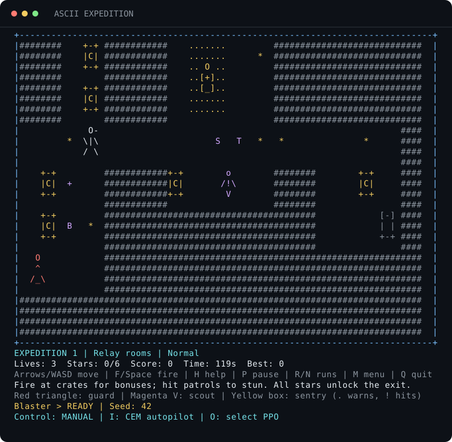

# ASCII Expedition

A C++ terminal arcade game that began as a learning project at a five-session EA game-development workshop in Bucharest. Learn the controls in two short tutorials, then collect stars, dodge guards and scouts, time your approach to sentries, and blast bonus crates in procedurally generated expeditions. Choose a difficulty, build a run score, and try to beat your saved best. Trained cross-entropy and PPO agents can also play generated expeditions using shared pathfinding.

## Workshop credit

This project was inspired by and developed with materials and guidance from the EA workshop. The original project README identifies [abuwarez/my-first-game](https://github.com/abuwarez/my-first-game) as the workshop support repository.

The exact split between workshop-provided code, instructor assistance, and participant contributions is no longer known. This repository preserves that learning project and does not claim that the original implementation was written independently from scratch.

## Build and play

Requirements: a **C++11 compiler**, **CMake 3.20+**, and an ANSI-compatible terminal with room for **80 columns by 37 rows**. Python 3.8+ enables the command-line and terminal integration tests; the game itself has no Python dependency.

On Ubuntu:

```sh
sudo apt-get update
sudo apt-get install build-essential cmake python3
```

From the repository root on Linux or macOS:

```sh
cmake -S "My first Game" -B build -DCMAKE_BUILD_TYPE=Release
cmake --build build --parallel 2
ctest --test-dir build --output-on-failure
./build/MyFirstGame
```

On Windows, install Visual Studio's C++ build tools and CMake, then use a developer terminal:

```powershell
cmake -S "My first Game" -B build
cmake --build build --config Release --parallel 2
ctest --test-dir build -C Release --output-on-failure
.\build\Release\MyFirstGame.exe
```

Choose **1 / 2 / 3** for Relaxed / Normal / Hard. **T** toggles the two-stage tutorial. Press **H** or **?** at any time for the game guide.



*Normal difficulty, seed 42. The dots around the sentry warn that its pulse is about to fire.*

## Watch a trained AI

After building, watch the included cross-entropy agent collect bonuses, shoot crates, and reach the exit:

```sh
python3 ai/watch.py --agent cem --seed 42
```

The optional PPO agent uses a small neural policy. Both learn objective selection on top of the same native pathfinding and timed game rules. On 128 held-out Normal expeditions, CEM averaged **3,699 points**, PPO **3,626**, and the nearest-star baseline **2,601**; all cleared every map. The guaranteed safe routes make this a scoring and planning experiment.

See the **[AI guide](ai/README.md)** for PPO setup, replay controls, readable CEM weights, training commands, benchmark data, and limitations. Human play has no machine-learning dependency.

## How to play

The opening menu lets you choose a difficulty with the arrow keys or W/S and start with Enter. Keys **1**, **2**, and **3** start Relaxed, Normal, and Hard immediately. **T** toggles the tutorial and **N** chooses a fresh seed. **H** or **?** opens a guide with controls, patrol silhouettes, and item effects.

| Difficulty | Starting lives | Expedition timer | Patrols |
| --- | --- | --- | --- |
| Relaxed | 5 | No deadline | 75% of normal movement speed |
| Normal | 3 | 2 minutes per map | Standard movement speed |
| Hard | 2 | 90 seconds per map | 135% speed and one extra patrol |

The two tutorial stages introduce the mechanics gradually. They are untimed and have randomized layouts:

| Stage | Goal | New mechanic |
| --- | --- | --- |
| Tutorial 1 | Collect every `*`, then reach the gate | Move with arrows or WASD; stars unlock the exit |
| Tutorial 2 | Collect stars and reach the gate | Avoid moving patrols or stun them with F / Space |

Press **Enter** after clearing a stage. Each new expedition generates another map and resets its timer according to the selected difficulty. Your score and remaining lives carry forward. Later expeditions gradually add stars, crates, and faster patrols, with progression capped to keep the map navigable.

A hit flashes the player and arena border red, then sends you back to the safe spawn with a brief shield; collected stars, broken crates, and points are preserved. Messages explain pickups, crate damage, points, stuns, and exit unlocks. Losing every life or running out of time ends the run.

### Blaster and bonuses

The first tutorial hints at the firing controls; the blaster unlocks in tutorial 2 so you can practice stunning patrols before the expeditions. Aim with the arrow keys or WASD in the direction of your last movement and press **F** or **Space**. It has unlimited shots, an eight-cell beam starting just outside the character, and a 0.3-second cooldown. Walls stop shots.

| Element | Behavior |
| --- | --- |
| `*` star | Collect all stars to open the exit; 100 points each |
| `C` crate | Blocks movement; two shots break it for 75 or 150 points |
| `c` damaged crate | One more shot breaks it |
| Red round-headed triangle | A guard patrolling a horizontal or vertical lane |
| Magenta `V` with a small round head | A faster scout patrolling its lane |
| Yellow box with a round head | A stationary sentry that periodically pulses around itself |
| Cyan patrol with `z` marks | Shooting a patrol freezes it and makes it harmless for two seconds |
| `S` shield | Five seconds of protection |
| `+` extra life | Adds a life, up to five; worth 100 points if already full |
| `T` time bonus | Adds 15 seconds, up to three minutes remaining; worth 100 points in Relaxed mode |
| `B` speed boost | Double movement for six seconds; Shift+WASD keeps precise single steps |

Each expedition includes a speed pickup as well as a shield, extra life, and time bonus. Crates can drop any of these four power-ups. Crates are optional: no required star or exit depends on destroying one.

A speed boost moves two cells per keypress, checking collisions and pickups at each cell. Further speed pickups refresh the six-second duration. Pausing freezes it; taking damage, advancing a stage, or restarting clears it.

Tutorial completion awards 250 points. Expedition completion adds 250 points per remaining life, plus 10 points per remaining second in timed modes.

All patrol types cost a life on contact unless you are shielded or they are stunned. Each has its own silhouette:

```text
 Guard    Scout    Sentry
   O        o        O
   ^       /!\      [+]
  /_\       V       [_]
```

Sentries have a three-second cycle. After 1.6 seconds, yellow dots mark the full 7×7 blast area for 0.8 seconds; red exclamation marks then pulse for 0.6 seconds. The warning itself is harmless. Shooting any patrol freezes its movement or pulse cycle and disables its damage for two seconds. Stunned patrols turn cyan and display `z` marks around their heads.

### Random maps and replay

Maps use three families of room layouts: linked relay rooms, crossroads with looping corridors, and a central courtyard with side rooms. Optional stash rooms hold bonus crates; required stars and exits stay outside them.

Spawn, exit, rooms, corridors, stars, patrol lanes, crates, and power-ups vary with the run seed. Patrol starting phases, crate rewards, and drops vary too. Patrol speed depends on its role, difficulty, and expedition number. The seed appears below the arena.

The generator checks connectivity for the full 3×3 character. Required stars, power-ups, and the exit have paths that avoid static obstacles, intact crates, the entire sweep of every moving patrol, and every sentry blast area. Every crate has an accessible firing position. Patrols offer risky shortcuts; they cannot make the objectives impossible to reach.

**R** restarts the run with the same seed, difficulty, and tutorial setting. **N** starts a fresh random run with those settings. Both reset points, lives, and run statistics. **M** ends the current run and returns to the difficulty menu. A seed plus difficulty reproduces the same maps on the same build and platform; layouts can differ across platforms or after generator changes:

```sh
./build/MyFirstGame --seed 42
./build/MyFirstGame --skip-tutorial --difficulty normal --seed 42
./build/MyFirstGame --difficulty relaxed
```

An explicit `--difficulty relaxed|normal|hard` starts immediately; otherwise the menu opens first.

### Summaries and saved records

Clearing a stage or losing a run displays your score, best score, expeditions cleared, stars, crates broken, hits taken, patrols stunned, active play time, and replay seed. A cleared tutorial does not count as an expedition. Pause, the help guide, menus, and summary screens do not add to active play time. Quitting also prints a run summary after restoring the terminal.

High scores are saved when you finish a stage or run, restart, return to the menu, or quit normally. There are separate records for each difficulty and for runs with or without the tutorial. Records store the best score and its seed; they do not save an unfinished run.

The default file is `~/.ea-workshop-highscores` on Linux/macOS and `.ea-workshop-highscores` under `%LOCALAPPDATA%` (or `%USERPROFILE%`) on Windows. If no home directory is available, it falls back to the current directory. To use a different file:

```sh
./build/MyFirstGame --scores-file /path/to/scores
```

The parent directory must already exist. Malformed scores are reported and ignored. Saving uses a temporary file and replacement; a failed save keeps the previous file intact, reports the failure, and retains the session best in memory so it can be retried on exit or restart.

## Controls

| Key | Action |
| --- | --- |
| Arrow keys or W / A / S / D | Move and aim up / left / down / right |
| Shift + W / A / S / D | Move one cell at a time while boosted |
| F / Space | Fire the blaster from tutorial 2 onward |
| Enter | Continue after clearing a stage |
| P | Pause or resume |
| H / ? | Open or close the game guide; Enter also closes it |
| R | Restart the same seed from the beginning |
| N | Start a new random run |
| M | End the current run and return to the difficulty menu |
| Q | Quit |

Shift+arrow keys also provide precise single steps in ANSI terminals. Uppercase movement keys provide precise single steps; lowercase keys use the speed boost when active. Other controls accept either case. Movement follows your terminal's keyboard repeat rate. Ctrl+C exits and restores the terminal on systems that deliver it as an interrupt. Use `--help` for command-line options.

The guide freezes movement, patrols, timers, and power-up durations. Closing it resumes a running game and preserves a game you had already paused. Gameplay keys are ignored while reading it.

If the window becomes too small, the game pauses automatically and shows the required size. Enlarge it to at least 80×37, then press **P** to resume. A small window at launch shows the same resize prompt without ending the program.

### Troubleshooting

- **"Run this game in an interactive terminal"**: launch it in a terminal tab that accepts keyboard input. IDE output panels and redirected output cannot drive the game.
- **Resize prompt**: enlarge the window or reduce its font size. Your run remains frozen until you resume it.
- **Shift+arrows are intercepted**: use uppercase W/A/S/D for precise steps while boosted.
- **High score could not be saved**: select a writable file in an existing directory with `--scores-file PATH`. The current run remains playable and a later save retries the session best.

## Code and validation

The current extension adds tutorial progression, seeded room layouts, difficulty profiles, collectibles, lives, scoring, three patrol roles, crate combat, power-ups, event feedback, run summaries, persistent high scores, pause/replay controls, an in-game guide, safe terminal resizing, buffered color rendering, and automated tests. These additions are distinct from the original workshop version retained in Git history.

- `Model/Game.*`: terminal-independent rules, progression, combat, and scoring.
- `Model/Level.*`: deterministic room generation, route checks, patrol movement, and sentry cycles.
- `Model/Difficulty.h`: lives, time limits, and patrol settings for each difficulty.
- `Geometry/` and the remaining model headers: shapes and character representations carried forward from the workshop project, with small safety fixes.
- `System/`: arrow/WASD input decoding, terminal restoration, buffered rendering, menu/summary views, and score persistence.
- `tests/GameTests.cpp`: checks 1,152 generated maps across all three difficulties, full-character routes around patrol sweeps and pulses, complete seeded playthroughs, combat, power-ups, feedback, statistics, timing, and replay.
- `tests/InputTests.cpp`: standard, application-mode, fragmented, and Shift-arrow sequences, plus Windows arrow scan codes.
- `tests/ScoreTests.cpp`: separate records, persistence across reloads, malformed data, failed-write preservation, and retry after recovery.
- `tests/cli_tests.py`: help, argument validation, and noninteractive launch errors on all platforms with Python.
- `tests/terminal_tests.py`: a real terminal playthrough on Linux/macOS covering both tutorials, menus, help, pause, sentry warnings, combat, speed/arrow controls, replay, saved scores, resizing, and terminal restoration on quit or interrupt. Test score files are isolated in temporary directories.

### Automated build checks

The [GitHub Actions workflow](.github/workflows/build.yml) is configured to build and test Linux, macOS, and Windows on pushes and pull requests. It enforces C++11 and treats compiler warnings as errors. A separate Linux job uses AddressSanitizer and UndefinedBehaviorSanitizer. Windows runs the C++ and command-line tests; the terminal integration suite uses POSIX terminal facilities on Linux/macOS.

To run the same strict checks locally:

```sh
cmake -S "My first Game" -B build -DCMAKE_BUILD_TYPE=Release \
  -DEA_WARNINGS_AS_ERRORS=ON -DEA_REQUIRE_INTEGRATION_TESTS=ON
cmake --build build --parallel 2
ctest --test-dir build --output-on-failure
```

For memory and undefined-behavior checks with GCC or Clang on Linux/macOS:

```sh
cmake -S "My first Game" -B build-sanitized -DCMAKE_BUILD_TYPE=Debug \
  -DEA_ENABLE_SANITIZERS=ON -DEA_WARNINGS_AS_ERRORS=ON \
  -DEA_REQUIRE_INTEGRATION_TESTS=ON
cmake --build build-sanitized --parallel 2
ctest --test-dir build-sanitized --output-on-failure
```

### Refresh the preview

The README image is captured from the executable and rendered as SVG using only Python's standard library. On Linux/macOS:

```sh
python3 tools/capture_preview.py build/MyFirstGame docs/gameplay.svg
```

The capture uses a temporary score file and restores the terminal when finished.

No external game engine or third-party C++ library is required.
